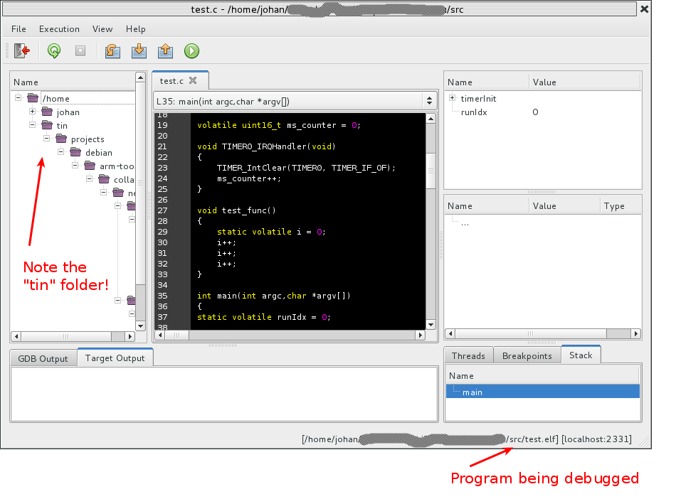
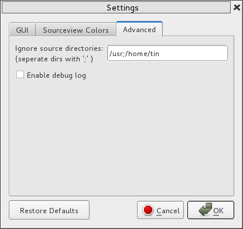

============================================
Debugging embedded system using Segger JLink
============================================

Debugging embedded systems (Eg: ARM) is quite easy with
Gede. What you need is GDBserver.

Segger provides a GDBServer for its JLink programming hardware.
Go to the homepage of Segger https://www.segger.com and download
'J-Link Software and Documentation Pack'.
The GDB server is included in the download.

For compiling I am using the ARM compiler included with the Debian release
but an alternative is to compile the toolchain from scratch.

JLink setup
===========

First we must start the JLink GDB server::

# JLink_Linux_V490c_x86_64
# ./JLinkGDBServer -if SWD -device EFM32TG222F32 -speed 1000

Configure Gede
==============

There are a number of settings that needs to be set in the Gede
settings dialog to be able debug a program on the ARM target.

Gede needs to know the GDB application program to use.
It also needs the port to use and target application.

If you need any extra settings then go to the *"Commands"* tab and enter
them there. Do not use a gdbinit file since it will confuse Gede.

The following image shows an example of an setup:

.. image:: images/settings.png

After pressing *"OK"* Gede will start the mainwindow and ask
the JLink gdb server to download the flash into the target.

After the target application has been downloaded into the target 
Gede will behave the same way as if debugging a local running
application.

There is however one thing that may be useful to know.

If we look in the file tree in gede we will see that my application
includes some files in *"/home/tin"* that where automaticly added by the compiler.
These directories takes up a lot of space in the treeview.

Lets hide these by opening up the settings dialog using the menu entry *"File->Settings"*.

By adding *"/home/tin"* to the list of directories Gede will hide the files and folders for us and
the file tree will be a lot cleaner.

