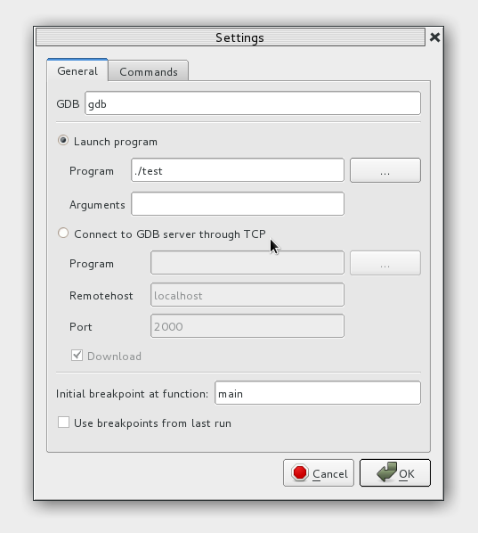
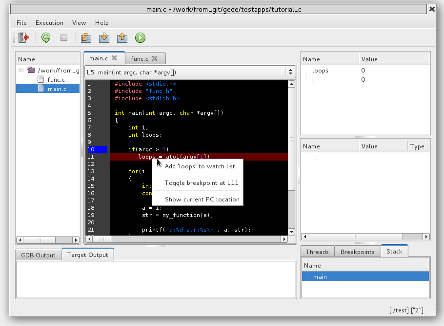
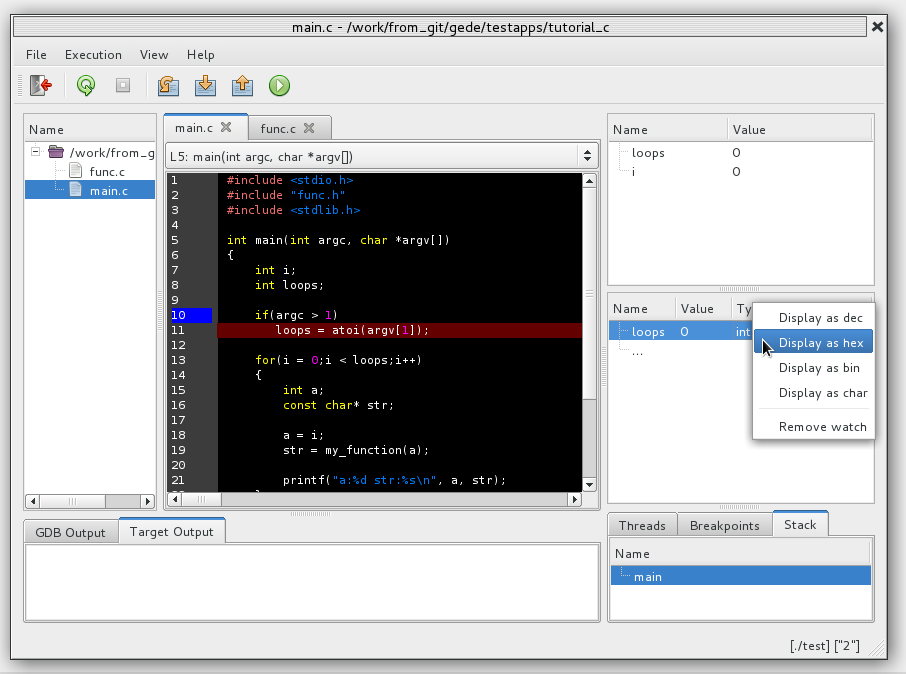
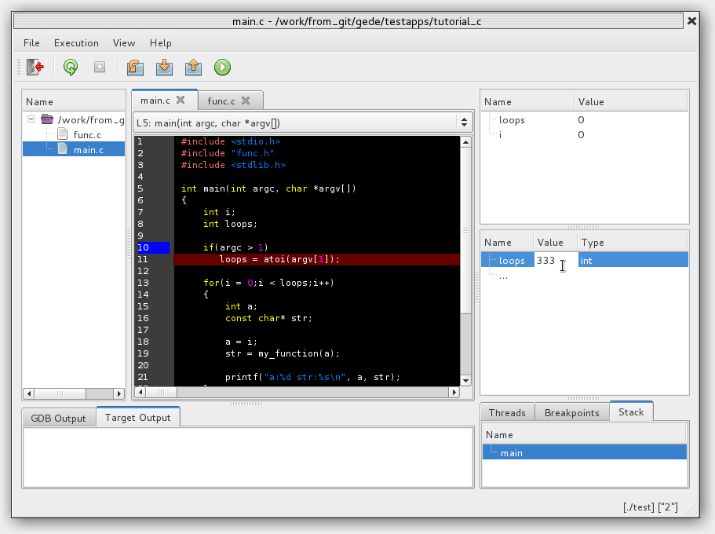
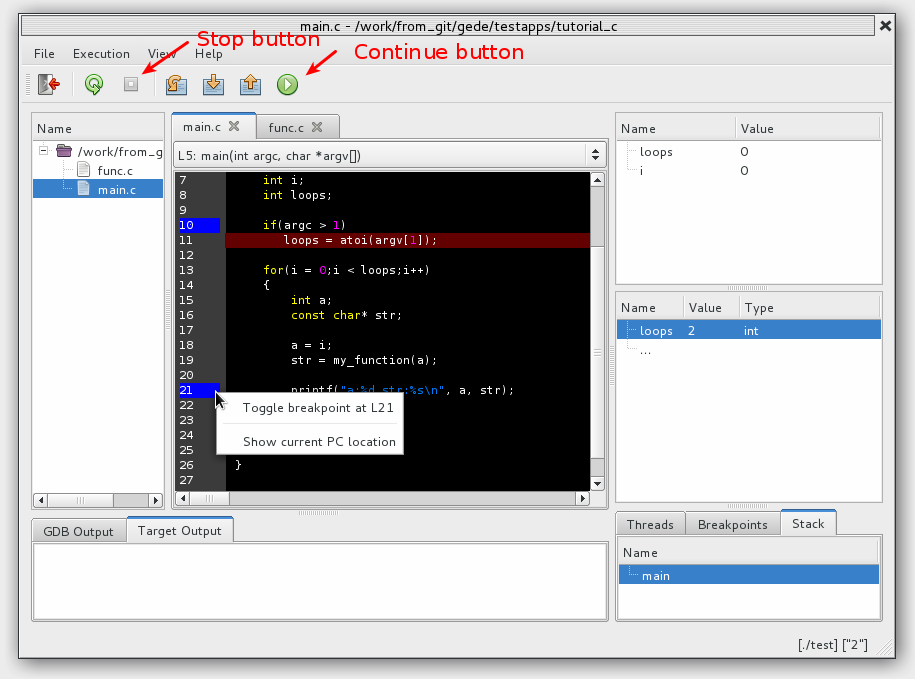

==========================
Local application tutorial
==========================

This tutorial covers debugging a local application.

For this tutorial I will be using a simple program written in C called "myprogram".
Source code is listed at the end of this article.

Start the debugger
==================

Lets start by going to the directory where our program is and launching gede::

# gede --args ./test

This will start gede and launch the configuration dialog:

If we want to have an argument to our application we can enter it in the "Arguments" editbox.
Our sample program takes a single argument so for this tutorial we will enter "2" in the "Arguments" editbox.

Gede uses two config files. One global configuration file and one project specific configuration file.
The global configuration file holds settings like for example the GUI while
the project file holds target settings like the program name and number of arguments.
The project configuration file ("gede2.ini") is saved in the current directory.
This means that any changes done in the dialog will be saved for the next time the program is being debugged.
It is there fore recommended to stand in the same directory as the program being debugged.

We then press "OK" to start debugging.

Main screen
===========

.. image:: ./images/mainwindow_overview.png
   :name: Mainwindow overview

When gede has launched the mainwindow will be displayed as shown above.

The filebrowser displays all the source files used by the test program.

Stepping through program
========================

Lets step one line through our program by pressing the "Next" toolbar button.

The watch view
==============

Not all variables will be shown in the local variables view. Lets try
to add a variable to the watch view. Right click on the "loops" variable in the
source view and select *"Add 'loops' to watch list"*.

You can also double click on the *"..."* field in the watch view and manually enter "loops".

The 'loops' variable is now shown in the watch view.

The way the variables are displayed can be changed by right clicking on the variable and select
the view format on the popup menu.

Watches can be removed by pressing "Delete" or by right clicking and select "Remove watch".

Watch variables can be changed by double clicking on the "Value" and entering the new value.
The value can be entered in binary by using the "0b<value>" syntax or hex using the "0x<value>" syntax.

Breakpoints
===========

Lets add a breakpoint by double clicking on the left border of the source line we would like the breakpoint to set at.

Breakpoints can also be added by right clicking on a line and selecting *'Toggle breakpoint at X'*. 

After we have set the breakpoint we press the *"Continue"* button to let the program continue execute. It will
then stop execute when it has reaced our breakpoint.

While the program is running it is possible to stop it by pressing the *"Stop"* button.

The test program used in the tutorial
=====================================

The program is divided into two files main.c and func.c.
The content of main.c is:

.. code:: c

    #include <stdio.h>
    #include "func.h"
    #include <stdlib.h>

    int main(int argc, char *argv[])
    {
        int i;
        int loops;

        if(argc > 1)
           loops = atoi(argv[1]);

        for(i = 0;i < loops;i++)
        {
            int a;
            const char* str;

            a = i;
            str = my_function(a);

            printf("a:%d str:%s\n", a, str);
        }

        return 0;
    }

And the content of func.c is:

.. code:: c

    #include "func.h"

    const char *my_function(int a)
    {
        int b;
        const char *str;
        b = a;
        
        if(b > 2)
            str = "Greater than 2";
        else
            str = "Less or equal to 2";

        return str;
    }

